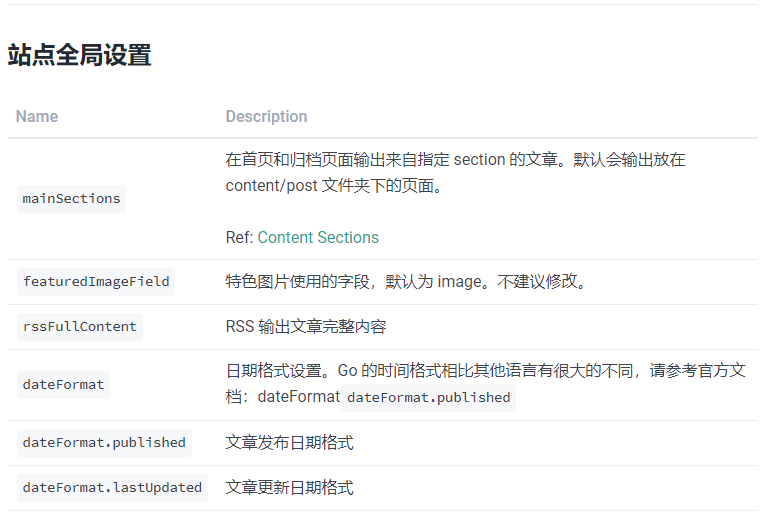
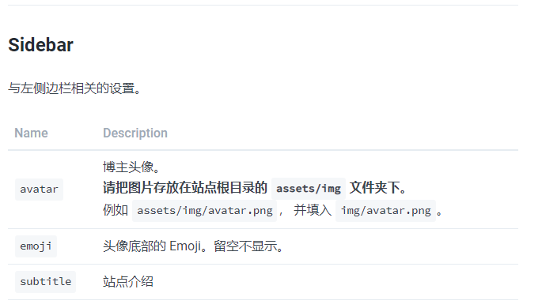
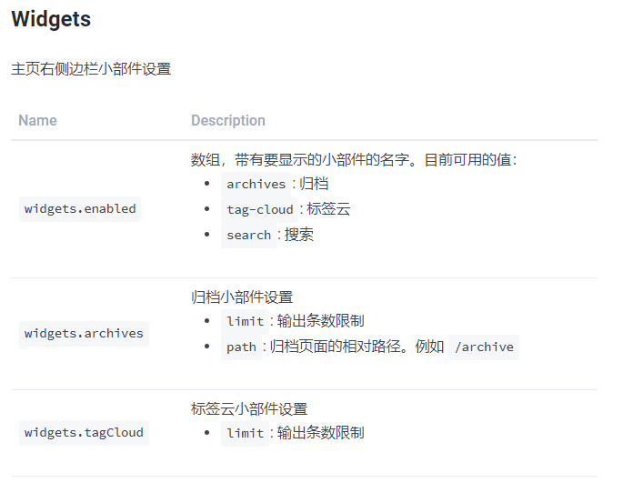
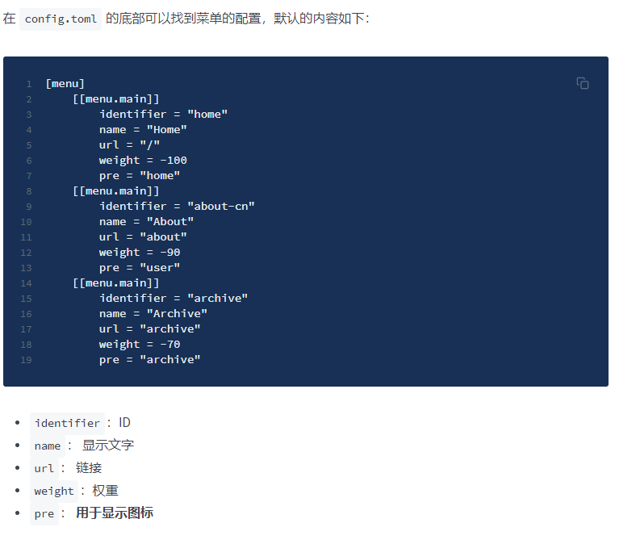

##### 编辑你的博客主题

今天来自定义Hugo使用的**stack**主题

-----

首先去到了主题的站点寻求说明文件，[主题说明](https://docs.stack.jimmycai.com/v/zh-cn/)一步步往下看

###### 1.站点全局设置

Hugo 的配置存放在站点根目录的 `config.toml` 里

在这里我们可以知道默认文章会放在content/post文件夹下面

###### 2.侧边栏设置

可以修改头像内容、站点介绍

头像默认是150×150 px 需要对头像修改一下尺寸

###### 3.评论设置 

需要一系列操作，本次先不执行

###### 4.右侧边栏

###### 5.自定义菜单

结果是一改就报错了
